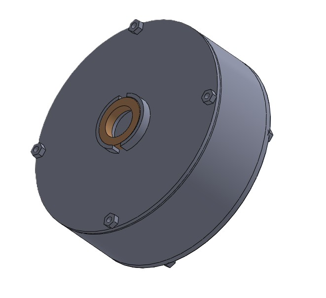
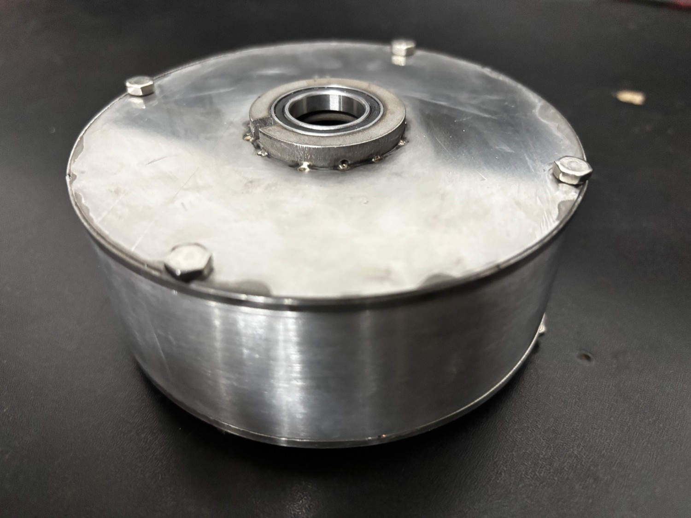
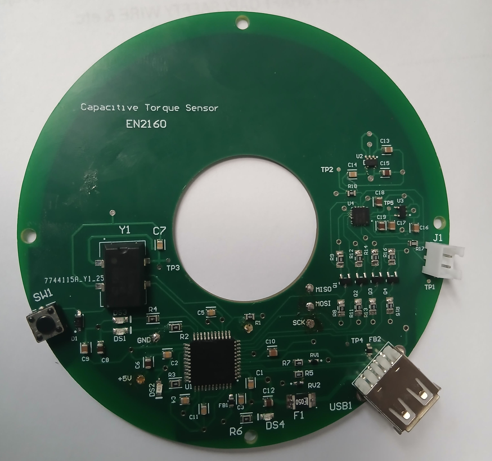
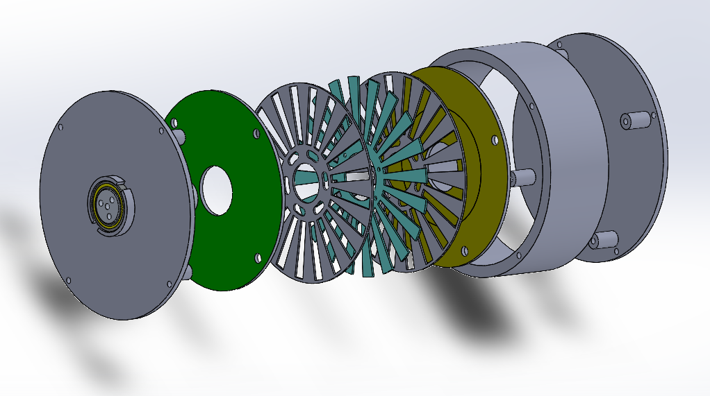
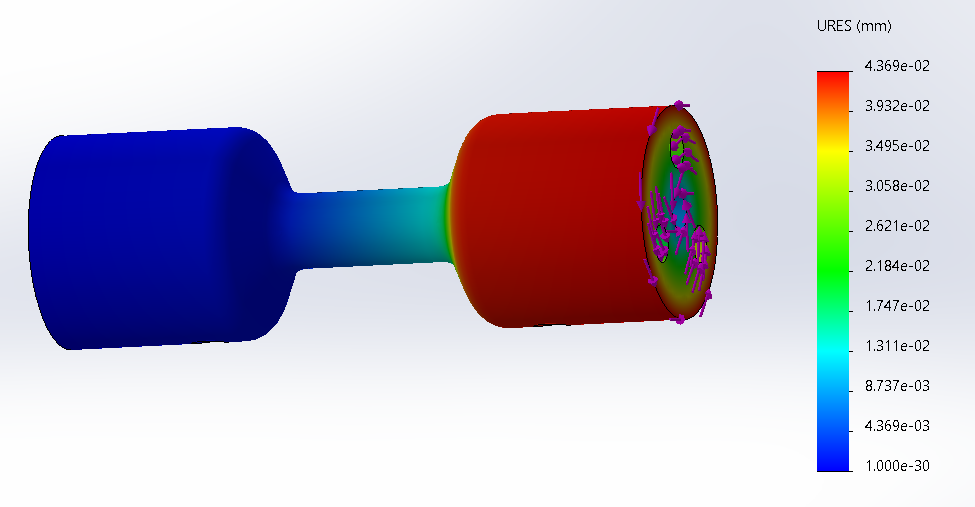

# Capacitive Torque Sensor Project

Welcome to the official repository for our **Capacitive Torque Sensor** – a novel torque sensing solution designed for precision, compactness, and cost-effectiveness. This repository contains all design files, documentation, and resources used in the development of our sensor system.

## 📂 What’s Inside?

This repo includes:

- ✅ **CAD Designs** (SolidWorks): 3D models for the sensor structure.
- ✅ **PCB Schematics** (Altium): Custom-designed electronics for sensing.
- ✅ **Firmware Code**: Interface microcontroller with CDC and output handler.
- ✅ **Documentation**:
  - Full Design Report
  - Production & Assembly Guidelines
  - User Manual
- ✅ **Images**: CAD visualizations, PCB renders, and actual prototype internals.

---

## 🛠️ Project Summary

Our system measures torque through **capacitive sensing technology**, leveraging the deformation of sensor plates to detect torque-induced changes in capacitance.

**Core Components:**

- **Sensor Design**: Custom plate layout for deflection measurement.
- **Capacitance-to-Digital Converter**: Using *PCAP04 CDC* for accurate sensing.
- **Microcontroller Interface**: *ATmega16U4/32U4* for data processing and USB communication.
- **Visualization**: Real-time torque output via display and PC interface.
- **Mechanical Housing**: Designed with precision for durability and alignment.

---

## 👥 Team & Collaboration

This project was accomplished by a passionate group of **8 dedicated undergraduate engineers** from the University of Moratuwa. Over weeks of brainstorming, prototyping, testing, and redesigning, we gave our full effort to bring this innovation to life.

---

## 📸 Highlights from the Build

### 1. Actual Final Product

### 2. Custom PCB

### 3. Internal View of Sensor

### 4. Exploded View

### 5. Finite Element Analysis

---

## 📌 Final Note

While we couldn't get a fully working sensor in the end, we achieved nearly **80% of our goal**. Our team poured countless hours into designing, simulating, assembling, coding, debugging, and refining this sensor. The journey taught us more than just engineering—it taught us perseverance, teamwork, and the power of iterative improvement.

---

